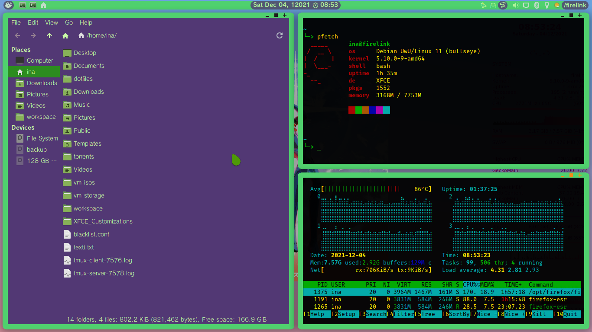
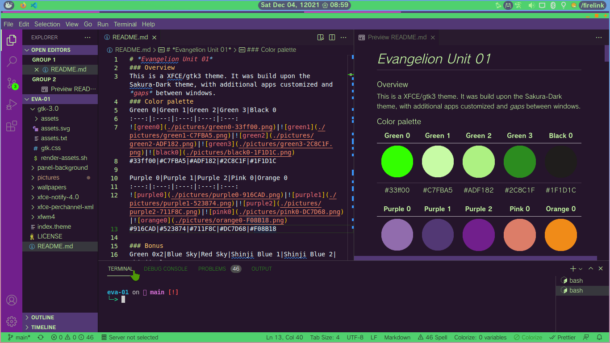

# *Evangelion Unit 01*
### Overview
This is a XFCE/gtk3 theme. It was build upon the Sakura-Dark theme, with additional apps customized and *gaps* between windows.
### Color palette
Green 0|Green 1|Green 2|Green 3|Black 0
:---:|:---:|:---:|:---:|:---:
||||
#33ff00|#C7FBA5|#ADF182|#2C8C1F|#1F1D1C

Purple 0|Purple 1|Purple 2|Pink 0|Orange 0
:---:|:---:|:---:|:---:|:---:
||||
#916CAD|#523874|#711F8C|#DC7D68|#F08B18
### About *gaps*
This theme only handles the inner gaps between windows, to add gaps to the outer line you must manually add in XFCE settings, go to:
	settings manager > Workspaces > Margins
In the screenshots the margins used is 3px on every side.
### How to install?
If you already don't have a theme folder in your home directory then create one:

`mkdir ~/.themes`

now clone this repo to your .themes directory:

`git clone https://github.com/inatagan/eva-01.git ~/.themes/eva-01`
### Preview
#### Desktop

#### Firefox && code

#### Thunar && Sakura terminal

#### Notifications

#### Whisker menu

#### VS Code

### XFCE Panel
Copy the panel config file to its default destination

`cp -i ~/.themes/eva-01/xfce-perchannel-xml/xfce4-panel.xml ~/.config/xfce4/xfconf/xfce-perchannel-xml/`

The panel uses a custom background, currently the background provided supports the following resolutions [4k, QHD, FHD and HD], if you want the panel to look the same on an unsupported screen you must edit/create a custom background to fit your screen resolution.

To set the background go to the panel settings, chose panel **1** > in the appearance tab set Style to Background image and chose the appropriate file, the bg image should be in `~/.themes/eva-01/panel-background/`
### XFWM window decorations
You can change the window decoration colors, by default this theme comes with 2 pre-made decoration colors, Eva Green 0 and Eva Green 3, see the color palette to see them.

Under the XWFM folder there are 2 subfolders containing the 2 different window decorations, `green0-33ff00` and `green3-2C8C1F`, to ""install"" them just copy the files in the subfolder to its parent folder `xfwm4`, you can also just run these commands:

**For Eva Green 0**

`cp -a ~/.themes/eva-01/xfwm4/green0-33ff00/. ~/.themes/eva-01/xfwm4/`

**For Eva Green 3**

`cp -a ~/.themes/eva-01/xfwm4/green3-2C8C1F/. ~/.themes/eva-01/xfwm4/`

After copying the files don't forget to reapply the theme for the changes to take effect.
### My Keybindings
Copy the keyboard shortcuts file if you want the same keybindings as well to `~/.config/xfce4/xfconf/xfce-perchannel-xml/`

`cp -i ~/.themes/eva-01/xfce-perchannel-xml/xfce4-keyboard-shortcuts.xml ~/.config/xfce4/xfconf/xfce-perchannel-xml/`

Some of the Keybindings are:

* `Super Key + W = Browser(Firefox)`

* `Super Key + F = File Manager(Thunar)`

* `Super Key + T = Terminal`

* `Super Key + C = Code`

* `Alt + F2 = Appfinder (Compact)`

* `Alt + F3 = Appfinder (Extended)`

* `Alt + F4 = Close current window`

* `Alt + F9 = Minimize current window`

* `Alt + F10 = Maximize current window`

* `PrtSc = XFCE Screnshot without capturing mouse cursor`

* `Shift + PrtSc = XFCE Screnshot with capturing mouse cursor`

* `Ctrl + Up = Volume up(+5%)`

* `Ctrl + Down = Volume down(-5%)`

XFWM provide minimal tiling functions, that are arranged as a grid with the following keybindings:

Super Key +
#|Left | Full side | Right
:---:|:---:|:---:|:---:
Top|7|8|9
Full side|U|null|O
Bottom|J|K|L

### Wallpapers
The main wallpaper was made using [this art as source](https://www.instagram.com/p/CWGAOQgP0_H/?utm_medium=copy_link) by @ikhimaz.
### Software shown and additional themes
Firefox theme [**EVA-01**](https://addons.mozilla.org/en-US/firefox/addon/eva-01-theme/)

Code theme [**EVA-01**](https://marketplace.visualstudio.com/items?itemName=inatagan.eva-01-vscode-theme)

Icons theme [**Papirus**](https://github.com/PapirusDevelopmentTeam/papirus-icon-theme) + [green folders](https://github.com/PapirusDevelopmentTeam/papirus-folders)

Mouse cursor theme [**Oreo spark lime**](https://github.com/varlesh/oreo-cursors)

---
